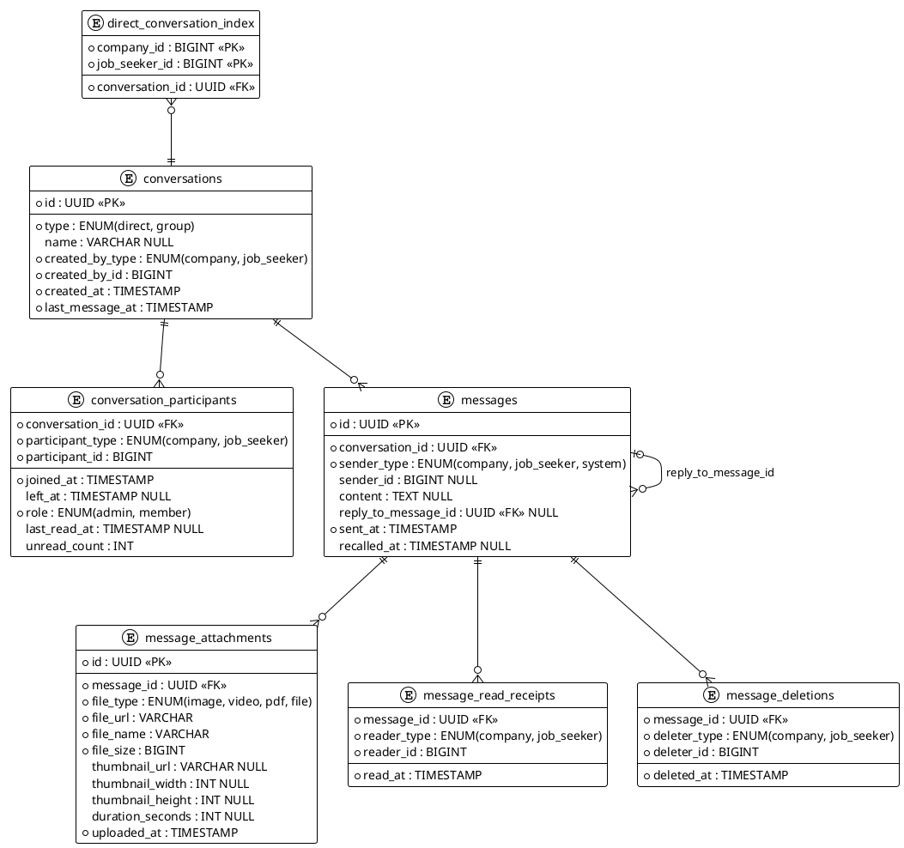

# 訊息對話儲存結構設計

## 功能需求

- 一對一對話（廠商 ↔ 求職者）
- 群組對話
- 訊息附件（含縮圖預覽）
- 訊息撤回
- 已讀回執（多人）
- 回覆特定訊息（Reply / Quote）
- 一對一對話防重複建立
- 大量資料時的查詢效能優化
- 未讀數角標與訊息已讀指示
- 已讀查詢（一對一 / 群組）
- 訊息回收（全員）與刪除（僅自己）

---

## 資料表設計

### Table 1：`conversations`（對話）

| 欄位 | 類型 | 說明 |
|------|------|------|
| `id` | UUID | PK |
| `type` | ENUM(`direct`, `group`) | 一對一 or 群組 |
| `name` | VARCHAR NULL | 群組名稱（一對一不需要） |
| `created_by_type` | ENUM(`company`, `job_seeker`) | 建立者類型 |
| `created_by_id` | BIGINT | 建立者 ID |
| `created_at` | TIMESTAMP | |
| `last_message_at` | TIMESTAMP | 列表排序用 |

---

### Table 2：`conversation_participants`（對話參與者）

| 欄位 | 類型 | 說明 |
|------|------|------|
| `conversation_id` | FK | 複合 PK |
| `participant_type` | ENUM(`company`, `job_seeker`) | 複合 PK |
| `participant_id` | BIGINT | 複合 PK |
| `joined_at` | TIMESTAMP | |
| `left_at` | TIMESTAMP NULL | 有值 = 已離開群組 |
| `role` | ENUM(`admin`, `member`) | 群組管理員用 |
| `last_read_at` | TIMESTAMP NULL | 該用戶最後讀到的時間點，用於計算未讀分隔線 |
| `unread_count` | INT | 快取未讀數，預設 0，用於對話列表角標 |

---

### Table 3：`messages`（訊息）

| 欄位 | 類型 | 說明 |
|------|------|------|
| `id` | UUID | PK |
| `conversation_id` | FK | |
| `sender_type` | ENUM(`company`, `job_seeker`, `system`) | `system` 用於系統通知 |
| `sender_id` | BIGINT NULL | 系統訊息為 NULL |
| `content` | TEXT NULL | 撤回後為 NULL |
| `reply_to_message_id` | FK NULL | 回覆哪則訊息（Self-referencing） |
| `sent_at` | TIMESTAMP | |
| `recalled_at` | TIMESTAMP NULL | 有值 = 已撤回 |

---

### Table 4：`message_attachments`（附件）

| 欄位 | 類型 | 說明 |
|------|------|------|
| `id` | UUID | PK |
| `message_id` | FK | |
| `file_type` | ENUM(`image`, `video`, `pdf`, `file`) | |
| `file_url` | VARCHAR | 原始檔路徑（S3/CDN） |
| `file_name` | VARCHAR | 原始檔名 |
| `file_size` | BIGINT | bytes |
| `thumbnail_url` | VARCHAR NULL | 縮圖路徑（image/video 才有） |
| `thumbnail_width` | INT NULL | |
| `thumbnail_height` | INT NULL | |
| `duration_seconds` | INT NULL | 影片/音訊長度 |
| `uploaded_at` | TIMESTAMP | |

---

### Table 5：`message_read_receipts`（已讀回執）

> 僅在用戶**明確點開已讀名單**時才寫入，不在每次進入對話時批次插入。
> 大部分已讀狀態由 `conversation_participants.last_read_at` 推導，此表負責精確逐筆紀錄。

| 欄位 | 類型 | 說明 |
|------|------|------|
| `message_id` | FK | 複合 PK |
| `reader_type` | ENUM(`company`, `job_seeker`) | 複合 PK |
| `reader_id` | BIGINT | 複合 PK |
| `read_at` | TIMESTAMP | |

---

### Table 7：`message_deletions`（訊息刪除紀錄）

> 僅對刪除者隱藏，其他人仍可看到原始訊息。

| 欄位 | 類型 | 說明 |
|------|------|------|
| `message_id` | FK | 複合 PK |
| `deleter_type` | ENUM(`company`, `job_seeker`) | 複合 PK |
| `deleter_id` | BIGINT | 複合 PK |
| `deleted_at` | TIMESTAMP | |

---

## 回收 vs 刪除行為對照

| | 回收（撤回） | 刪除 |
|---|---|---|
| 影響範圍 | 所有人 | 只有自己 |
| 儲存方式 | `messages.recalled_at` + `content = NULL` | `message_deletions` 插入一筆 |
| 其他人看到 | 「此訊息已撤回」 | 原始訊息不變 |
| 誰可以操作 | 發送者本人 | 任何參與者 |

---

## 關聯圖

```
direct_conversation_index  ← 一對一對話反查（快速定位）
        ↓
conversations
    ├── conversation_participants (1:N)
    └── messages (1:N)  ← idx: (conversation_id, sent_at DESC)
            ├── reply_to_message_id → messages (self-ref FK)
            ├── message_attachments (1:N)
            ├── message_read_receipts (1:N)  ← idx: (reader_type, reader_id)
            └── message_deletions (1:N)
```

---

## Table 6：`direct_conversation_index`（一對一對話反查）

| 欄位 | 類型 | 說明 |
|------|------|------|
| `company_id` | BIGINT | 複合 PK |
| `job_seeker_id` | BIGINT | 複合 PK |
| `conversation_id` | UUID FK | 指向 `conversations` |

> 建立一對一對話時同步寫入，查詢時直接命中，無需 JOIN `conversation_participants`

---

## 索引設計

```sql
-- 訊息列表分頁（Cursor-based）
CREATE INDEX idx_messages_conversation_sent
ON messages (conversation_id, sent_at DESC);

-- 未讀數查詢
CREATE INDEX idx_read_receipts_reader
ON message_read_receipts (reader_type, reader_id, message_id);
```

### 未讀數更新時機

| 事件 | 動作 |
|------|------|
| 新訊息送出 | 對所有參與者（除發送者）`unread_count + 1` |
| 用戶進入對話 | 該用戶 `unread_count = 0`、`last_read_at = NOW()` |

### 未讀分隔線查詢（進入對話時）

```sql
-- 利用 idx_messages_conversation_sent 索引
SELECT COUNT(*) FROM messages
WHERE conversation_id = :conversation_id
  AND sent_at > :last_read_at
  AND sender_id != :me;
```

### 標記已讀（進入對話時）

```sql
-- 單一語句完成，不需批次 INSERT 至 message_read_receipts
UPDATE conversation_participants
SET last_read_at = NOW(),
    unread_count = 0
WHERE conversation_id = :conversation_id
  AND participant_type = :my_type
  AND participant_id = :me;
```

### 已讀查詢：一對一

```sql
-- 判斷我的訊息是否被對方讀過（純時間比對，無需掃描 message_read_receipts）
SELECT cp.last_read_at >= m.sent_at AS is_read
FROM messages m
JOIN conversation_participants cp
  ON cp.conversation_id = m.conversation_id
  AND cp.participant_id != :me
WHERE m.id = :message_id;
```

### 已讀查詢：群組已讀人數

```sql
-- 幾人已讀這則訊息
SELECT COUNT(*) AS read_count
FROM messages m
JOIN conversation_participants cp
  ON cp.conversation_id = m.conversation_id
  AND cp.participant_id != m.sender_id
WHERE m.id = :message_id
  AND cp.last_read_at >= m.sent_at;
```

### 已讀查詢：群組已讀名單（點開查看）

```sql
-- 誰看過這則訊息
SELECT cp.participant_type, cp.participant_id
FROM messages m
JOIN conversation_participants cp
  ON cp.conversation_id = m.conversation_id
  AND cp.participant_id != m.sender_id
WHERE m.id = :message_id
  AND cp.last_read_at >= m.sent_at;
```

### Cursor-based Pagination 範例

```sql
-- 取得某對話，sent_at < cursor 的前 20 則訊息
SELECT * FROM messages
WHERE conversation_id = :conversation_id
  AND sent_at < :cursor
ORDER BY sent_at DESC
LIMIT 20;
```

> 比 OFFSET 快，資料量越大差距越明顯

---

## 各查詢場景的效能對應

| 查詢場景 | 解法 |
|------|------|
| 找廠商 A ↔ 求職者 A 的對話 | `direct_conversation_index` 直接命中 |
| 撈某對話的訊息列表 | `idx_messages_conversation_sent` + Cursor 分頁 |
| 對話列表未讀角標 | `conversation_participants.unread_count` 直接讀取（O(1)） |
| 進入對話後未讀分隔線 | `last_read_at` + `idx_messages_conversation_sent` |
| 一對一已讀判斷 | `last_read_at >= message.sent_at` 時間比對 |
| 群組已讀人數 | JOIN `conversation_participants` 比對 `last_read_at` |
| 群組已讀名單（精確時間） | `message_read_receipts`（按需寫入） |
| 撈訊息列表（排除自己刪除的） | LEFT JOIN `message_deletions` 過濾 |
| 對話列表排序 | `conversations.last_message_at` 冗餘欄位 |

---

## 設計決策說明

| 決策 | 原因 |
|------|------|
| 參與者獨立成表 | 支援任意人數，一對一只是參與者剛好 = 2 的群組 |
| 撤回用 `recalled_at` 而非刪除 | 保留稽核紀錄，前端可顯示「此訊息已撤回」 |
| 附件獨立成表 | 一則訊息可多附件，方便單獨查詢附件清單 |
| 已讀用獨立表 | 支援多人已讀，未來擴充群組不需改表結構 |
| `left_at` 而非刪除參與者 | 離開後仍可查看離開前的訊息紀錄 |
| `system` sender_type | 成員加入/離開事件作為系統訊息統一儲存 |
| `reply_to_message_id` 自我關聯 | 查詢時 JOIN 自身即可取得被引用訊息內容 |
| `thumbnail_url` 非同步產生 | 後端上傳後由 Lambda 產生，產生前為 NULL |
| `last_message_at` 冗餘欄位 | 避免列出對話列表時 JOIN 計算效能問題 |
| `direct_conversation_index` 反查表 | 一對一對話定位從雙 JOIN 降為單一 PK 查詢 |
| Cursor-based Pagination | 比 OFFSET 快，資料量越大差距越明顯 |
| `idx_messages_conversation_sent` | 訊息列表分頁查詢命中索引，避免全表掃描 |
| `idx_read_receipts_reader` | 未讀數查詢命中索引，避免逐筆掃描 |
| `unread_count` 快取欄位 | 對話列表角標 O(1) 讀取，避免每次 COUNT |
| `last_read_at` cursor 欄位 | 進入對話後精確定位未讀分隔線，不依賴 COUNT(*) |
| 未讀/已讀三層分離 | `unread_count`（角標）、`last_read_at`（分隔線 + 已讀推導）、`message_read_receipts`（精確逐筆，按需寫入）各司其職 |
| 已讀用時間比對而非 JOIN receipts | 大部分情境只需比對 `last_read_at >= sent_at`，效能更好 |
| 刪除用獨立表而非軟刪除 | 刪除是「個人視角」，不能修改 `messages` 主表，其他人不受影響 |
| 回收 vs 刪除分開設計 | 兩者語意不同：回收影響所有人、刪除只影響自己，不應混用同一欄位 |

---

## 訊息回收與刪除查詢

### 回收訊息

```sql
-- 發送者本人才能回收
UPDATE messages
SET content     = NULL,
    recalled_at = NOW()
WHERE id        = :message_id
  AND sender_id = :me;
```

### 刪除訊息（僅自己）

```sql
INSERT INTO message_deletions (message_id, deleter_type, deleter_id, deleted_at)
VALUES (:message_id, :my_type, :me, NOW());
```

### 撈訊息列表（排除自己刪除的）

```sql
SELECT m.*
FROM messages m
LEFT JOIN message_deletions md
  ON md.message_id   = m.id
  AND md.deleter_type = :my_type
  AND md.deleter_id   = :me
WHERE m.conversation_id = :conversation_id
  AND md.message_id IS NULL     -- 排除自己刪除的
  AND m.sent_at < :cursor
ORDER BY m.sent_at DESC
LIMIT 20;
```

---

## 一對一對話防重複建立

透過 `direct_conversation_index` 的複合 PK 保證唯一性，建立前先查詢：

```sql
-- 直接命中，無需 JOIN
SELECT conversation_id
FROM direct_conversation_index
WHERE company_id = :company_id
  AND job_seeker_id = :job_seeker_id;
```

存在則直接返回，不存在才建立並同步寫入 `direct_conversation_index`。

---

## PlantUML



---

## Mermaid


