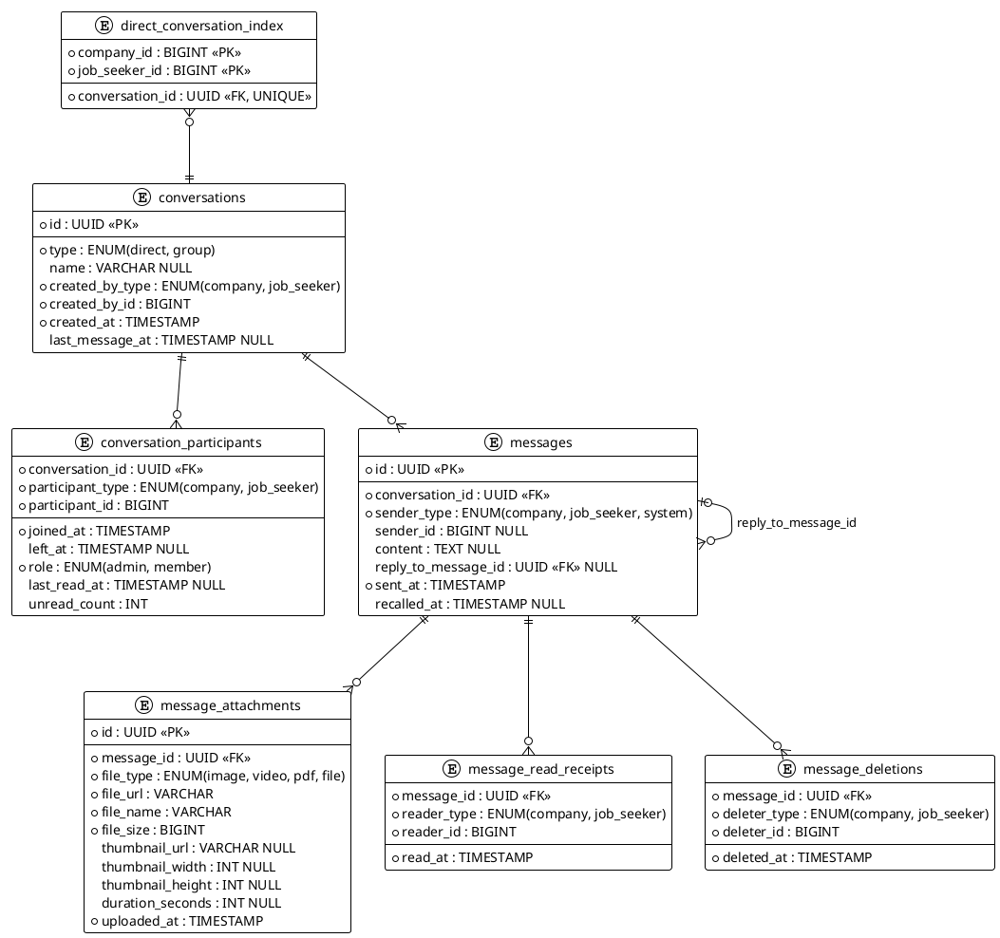
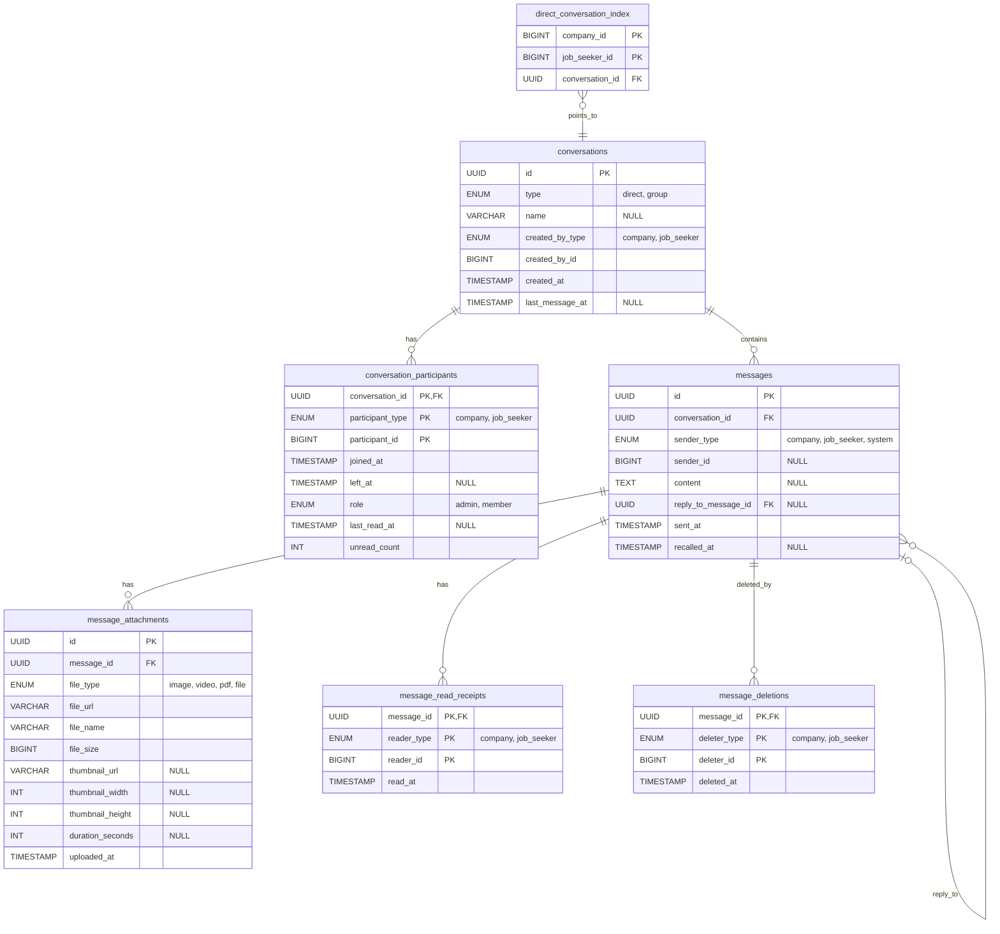

# 訊息對話儲存結構設計

## 功能需求

- 一對一對話（廠商 ↔ 求職者）
- 群組對話
- 訊息附件（含縮圖預覽）
- 訊息撤回
- 已讀回執（多人）
- 回覆特定訊息（Reply / Quote）
- 一對一對話防重複建立
- 大量資料時的查詢效能優化
- 未讀數角標與訊息已讀指示
- 已讀查詢（一對一 / 群組）
- 訊息回收（全員）與刪除（僅自己）

---

## 資料表設計

### Table 1：`conversations`（對話）

| 欄位 | 類型 | 說明 |
|------|------|------|
| `id` | UUID | PK |
| `type` | ENUM(`direct`, `group`) | 一對一 or 群組 |
| `name` | VARCHAR NULL | 群組名稱；一對一應為 NULL |
| `created_by_type` | ENUM(`company`, `job_seeker`) | 建立者類型 |
| `created_by_id` | BIGINT | 建立者 ID |
| `created_at` | TIMESTAMP | |
| `last_message_at` | TIMESTAMP NULL | 對話列表排序用 |

> 建議約束：
> - `type = 'direct'` 時，`name` 應為 `NULL`
> - `type = 'group'` 時，若產品規則要求群組一定有名稱，應由 DB CHECK 或服務層驗證保證

---

### Table 2：`conversation_participants`（對話參與者）

| 欄位 | 類型 | 說明 |
|------|------|------|
| `conversation_id` | UUID FK | 複合 PK |
| `participant_type` | ENUM(`company`, `job_seeker`) | 複合 PK |
| `participant_id` | BIGINT | 複合 PK |
| `joined_at` | TIMESTAMP | 加入時間 |
| `left_at` | TIMESTAMP NULL | 有值 = 已離開群組 |
| `role` | ENUM(`admin`, `member`) | 群組管理員用；一對一固定 `member` |
| `last_read_at` | TIMESTAMP NULL | 該用戶最後讀到的時間點 |
| `unread_count` | INT | 快取未讀數，預設 0，用於對話列表角標 |

> `participant_type + participant_id` 是同一個身分主鍵，不可只比對 `participant_id`。

---

### Table 3：`messages`（訊息）

| 欄位 | 類型 | 說明 |
|------|------|------|
| `id` | UUID | PK |
| `conversation_id` | UUID FK | |
| `sender_type` | ENUM(`company`, `job_seeker`, `system`) | `system` 用於系統通知 |
| `sender_id` | BIGINT NULL | `system` 訊息為 `NULL` |
| `content` | TEXT NULL | 可為純附件訊息；撤回後為 `NULL` |
| `reply_to_message_id` | UUID FK NULL | 回覆哪則訊息（Self-referencing） |
| `sent_at` | TIMESTAMP | |
| `recalled_at` | TIMESTAMP NULL | 有值 = 已撤回 |

> 建議約束：
> - `sender_type = 'system'` 時，`sender_id` 必須為 `NULL`
> - `sender_type != 'system'` 時，`sender_id` 必須有值
> - 非系統訊息的 `sender_type + sender_id` 應為該對話在 `sent_at` 當下的有效參與者
> - `reply_to_message_id` 應限制為同一個 `conversation_id`

---

### Table 4：`message_attachments`（附件）

| 欄位 | 類型 | 說明 |
|------|------|------|
| `id` | UUID | PK |
| `message_id` | UUID FK | |
| `file_type` | ENUM(`image`, `video`, `pdf`, `file`) | |
| `file_url` | VARCHAR | 私有儲存路徑或簽名 URL，不應使用公開固定 URL |
| `file_name` | VARCHAR | 原始檔名 |
| `file_size` | BIGINT | bytes |
| `thumbnail_url` | VARCHAR NULL | 縮圖路徑（image/video 才有） |
| `thumbnail_width` | INT NULL | |
| `thumbnail_height` | INT NULL | |
| `duration_seconds` | INT NULL | 影片/音訊長度 |
| `uploaded_at` | TIMESTAMP | |

> 附件可見性由 `messages.recalled_at` 控制；若訊息已撤回，API 不應再回傳附件資訊。

---

### Table 5：`message_read_receipts`（已讀回執）

> 大部分已讀狀態仍由 `conversation_participants.last_read_at` 推導。
> 此表只在「需要保留精確 `read_at` 或顯示已讀名單歷程」時寫入，而且必須在**實際讀到當下**寫入，不能等到點開名單時才補寫。

| 欄位 | 類型 | 說明 |
|------|------|------|
| `message_id` | UUID FK | 複合 PK |
| `reader_type` | ENUM(`company`, `job_seeker`) | 複合 PK |
| `reader_id` | BIGINT | 複合 PK |
| `read_at` | TIMESTAMP | 實際讀取時間 |

---

### Table 6：`direct_conversation_index`（一對一對話反查）

| 欄位 | 類型 | 說明 |
|------|------|------|
| `company_id` | BIGINT | 複合 PK |
| `job_seeker_id` | BIGINT | 複合 PK |
| `conversation_id` | UUID FK UNIQUE | 指向 `conversations.id`，且只允許 `type = direct` |

> 建立一對一對話時同步寫入，查詢時直接命中，無需 JOIN `conversation_participants`。

---

### Table 7：`message_deletions`（訊息刪除紀錄）

> 僅對刪除者隱藏，其他人仍可看到原始訊息。

| 欄位 | 類型 | 說明 |
|------|------|------|
| `message_id` | UUID FK | 複合 PK |
| `deleter_type` | ENUM(`company`, `job_seeker`) | 複合 PK |
| `deleter_id` | BIGINT | 複合 PK |
| `deleted_at` | TIMESTAMP | |

---

## 必要資料約束

- `direct` 對話必須恆為 2 位有效參與者，且只能是 1 位 `company` + 1 位 `job_seeker`
- `group` 對話可為多人，成員異動以 `joined_at` / `left_at` 表示，不直接刪參與者資料
- `direct_conversation_index.conversation_id` 只能對應 `conversations.type = 'direct'`
- 所有使用者判斷都必須以 `type + id` 一起比對，不可只比較 `id`
- 已讀人數、已讀名單、訊息可見範圍都必須考慮成員在訊息送出當下是否已加入、是否已離開
- `message_read_receipts` 若啟用，必須在實際已讀事件發生時寫入；若不需要精確 `read_at`，可只用 `last_read_at`

---

## 回收 vs 刪除行為對照

| | 回收（撤回） | 刪除 |
|---|---|---|
| 影響範圍 | 所有人 | 只有自己 |
| 儲存方式 | `messages.recalled_at` + `content = NULL` | `message_deletions` 插入一筆 |
| 其他人看到 | 「此訊息已撤回」 | 原始訊息不變 |
| 附件處理 | 不再回傳附件資訊 | 原始附件不變 |
| 誰可以操作 | 發送者本人 | 任何參與者 |

---

## 關聯圖

```
direct_conversation_index  ← 一對一對話反查（快速定位）
        ↓
conversations
    ├── conversation_participants (1:N)
    └── messages (1:N)  ← idx: (conversation_id, sent_at DESC, id DESC)
            ├── reply_to_message_id → messages (self-ref FK)
            ├── message_attachments (1:N)
            ├── message_read_receipts (1:N)  ← idx: (reader_type, reader_id, message_id)
            └── message_deletions (1:N)
```

---

## 索引設計

```sql
-- 訊息列表分頁（穩定 Cursor-based Pagination）
CREATE INDEX idx_messages_conversation_sent_id
ON messages (conversation_id, sent_at DESC, id DESC);

-- 對話列表：由使用者反查參與中的對話
CREATE INDEX idx_conversation_participants_lookup
ON conversation_participants (participant_type, participant_id, left_at, conversation_id);

-- 對話內查有效參與者（已讀人數 / 發送權限 / 群組資訊）
CREATE INDEX idx_conversation_participants_active
ON conversation_participants (conversation_id, left_at, participant_type, participant_id);

-- 精確已讀名單
CREATE INDEX idx_read_receipts_reader
ON message_read_receipts (reader_type, reader_id, message_id);
```

---

## 未讀數更新時機

| 事件 | 動作 |
|------|------|
| 新訊息送出 | 對所有在 `sent_at` 當下仍為有效參與者，且不是發送者本人的成員執行 `unread_count + 1` |
| 用戶進入對話 | 該用戶 `last_read_at = 已讀時間`、`unread_count = 0` |
| 需要精確 `read_at` | 於實際已讀時批次 `UPSERT` `message_read_receipts` |

---

## 未讀與已讀查詢

### 未讀分隔線查詢（進入對話時）

```sql
-- 利用 idx_messages_conversation_sent_id 索引
SELECT COUNT(*)
FROM messages m
WHERE m.conversation_id = :conversation_id
  AND m.sent_at > :last_read_at
  AND NOT (
    m.sender_type = :my_type
    AND m.sender_id = :me
  );
```

### 標記已讀（進入對話時）

```sql
UPDATE conversation_participants
SET last_read_at = GREATEST(
        COALESCE(last_read_at, TIMESTAMP '1970-01-01 00:00:00'),
        :read_at
    ),
    unread_count = 0
WHERE conversation_id = :conversation_id
  AND participant_type = :my_type
  AND participant_id = :me;
```

### 精確已讀回執寫入（選配）

```sql
INSERT INTO message_read_receipts (message_id, reader_type, reader_id, read_at)
SELECT m.id, :my_type, :me, :read_at
FROM messages m
WHERE m.conversation_id = :conversation_id
  AND m.sent_at > COALESCE(:previous_last_read_at, TIMESTAMP '1970-01-01 00:00:00')
  AND m.sent_at <= :read_at
  AND NOT (
    m.sender_type = :my_type
    AND m.sender_id = :me
  )
ON CONFLICT (message_id, reader_type, reader_id) DO NOTHING;
```

### 已讀查詢：一對一

```sql
-- 判斷我送出的訊息是否被對方讀過
SELECT cp.last_read_at >= m.sent_at AS is_read
FROM messages m
JOIN conversation_participants cp
  ON cp.conversation_id = m.conversation_id
  AND NOT (
    cp.participant_type = :my_type
    AND cp.participant_id = :me
  )
  AND cp.joined_at <= m.sent_at
  AND (cp.left_at IS NULL OR cp.left_at > m.sent_at)
WHERE m.id = :message_id
  AND m.sender_type = :my_type
  AND m.sender_id = :me;
```

### 已讀查詢：群組已讀人數

```sql
SELECT COUNT(*) AS read_count
FROM messages m
JOIN conversation_participants cp
  ON cp.conversation_id = m.conversation_id
  AND NOT (
    cp.participant_type = m.sender_type
    AND cp.participant_id = m.sender_id
  )
  AND cp.joined_at <= m.sent_at
  AND (cp.left_at IS NULL OR cp.left_at > m.sent_at)
WHERE m.id = :message_id
  AND cp.last_read_at >= m.sent_at;
```

### 已讀查詢：群組已讀名單

```sql
SELECT cp.participant_type, cp.participant_id
FROM messages m
JOIN conversation_participants cp
  ON cp.conversation_id = m.conversation_id
  AND NOT (
    cp.participant_type = m.sender_type
    AND cp.participant_id = m.sender_id
  )
  AND cp.joined_at <= m.sent_at
  AND (cp.left_at IS NULL OR cp.left_at > m.sent_at)
WHERE m.id = :message_id
  AND cp.last_read_at >= m.sent_at;
```

---

## Cursor-based Pagination 範例

```sql
-- 取得某對話在 (sent_at, id) 複合游標之前的前 20 則訊息
SELECT m.*
FROM messages m
WHERE m.conversation_id = :conversation_id
  AND (
    m.sent_at < :cursor_sent_at
    OR (
      m.sent_at = :cursor_sent_at
      AND m.id < :cursor_id
    )
  )
ORDER BY m.sent_at DESC, m.id DESC
LIMIT 20;
```

> 單用 `sent_at` 當 cursor，在同一時間有多筆訊息時會出現漏資料或重複資料。

---

## 訊息回收與刪除查詢

### 回收訊息

```sql
-- 發送者本人才能回收；身分判斷必須比對 type + id
UPDATE messages
SET content     = NULL,
    recalled_at = NOW()
WHERE id = :message_id
  AND sender_type = :my_type
  AND sender_id = :me;
```

### 刪除訊息（僅自己）

```sql
INSERT INTO message_deletions (message_id, deleter_type, deleter_id, deleted_at)
VALUES (:message_id, :my_type, :me, NOW());
```

### 撈訊息列表（排除自己刪除的，且只看自己有效成員期間內的訊息）

```sql
SELECT m.*
FROM messages m
JOIN conversation_participants cp
  ON cp.conversation_id = m.conversation_id
  AND cp.participant_type = :my_type
  AND cp.participant_id = :me
LEFT JOIN message_deletions md
  ON md.message_id = m.id
  AND md.deleter_type = :my_type
  AND md.deleter_id = :me
WHERE m.conversation_id = :conversation_id
  AND md.message_id IS NULL
  AND m.sent_at >= cp.joined_at
  AND (cp.left_at IS NULL OR m.sent_at < cp.left_at)
  AND (
    m.sent_at < :cursor_sent_at
    OR (
      m.sent_at = :cursor_sent_at
      AND m.id < :cursor_id
    )
  )
ORDER BY m.sent_at DESC, m.id DESC
LIMIT 20;
```

> 若要支援第一頁載入，可在應用層以目前時間與最大 UUID 作為初始 cursor。

---

## 一對一對話防重複建立

透過 `direct_conversation_index` 的複合 PK 保證唯一性，建立前先查詢：

```sql
SELECT conversation_id
FROM direct_conversation_index
WHERE company_id = :company_id
  AND job_seeker_id = :job_seeker_id;
```

存在則直接返回；不存在才建立 `conversations`、兩筆 `conversation_participants`，並在同一交易內同步寫入 `direct_conversation_index`。

---

## 各查詢場景的效能對應

| 查詢場景 | 解法 |
|------|------|
| 找廠商 A ↔ 求職者 B 的對話 | `direct_conversation_index` 直接命中 |
| 撈某對話的訊息列表 | `idx_messages_conversation_sent_id` + 複合 cursor 分頁 |
| 對話列表 | `idx_conversation_participants_lookup` 先找出使用者參與的對話，再依 `conversations.last_message_at` 排序 |
| 對話列表未讀角標 | `conversation_participants.unread_count` 直接讀取（O(1)） |
| 進入對話後未讀分隔線 | `last_read_at` + `idx_messages_conversation_sent_id` |
| 一對一已讀判斷 | `last_read_at >= message.sent_at`，但要比對對方有效成員期間 |
| 群組已讀人數 | JOIN `conversation_participants` 比對 `last_read_at`，並過濾 sender 與無效成員 |
| 群組已讀名單（精確時間） | `message_read_receipts`，於實際已讀時寫入 |
| 撈訊息列表（排除自己刪除的） | JOIN `conversation_participants` + LEFT JOIN `message_deletions` 過濾 |
| 對話列表排序 | `conversations.last_message_at` 冗餘欄位 |

---

## 設計決策說明

| 決策 | 原因 |
|------|------|
| 參與者獨立成表 | 支援任意人數，一對一只是參與者剛好 = 2 的特例 |
| 所有身分都用 `type + id` 比對 | 避免 `company.id = 1` 與 `job_seeker.id = 1` 被誤判成同一人 |
| `joined_at` / `left_at` 保留成員生命週期 | 已讀、未讀、訊息可見範圍都必須依訊息送出當下判斷 |
| 撤回用 `recalled_at` 而非刪除主資料 | 保留稽核紀錄，前端可顯示「此訊息已撤回」 |
| 附件由父訊息可見性控制 | 避免訊息撤回後附件仍可被直接讀取 |
| 已讀用三層分離 | `unread_count` 管角標、`last_read_at` 管主流程判斷、`message_read_receipts` 管精確 `read_at` |
| `message_read_receipts` 只在實際已讀時寫入 | 否則 `read_at` 會失真，無法代表真正閱讀時間 |
| `reply_to_message_id` 自我關聯 | 查詢時可取得被引用訊息內容 |
| `last_message_at` 冗餘欄位 | 避免列出對話列表時即時計算最新訊息 |
| `direct_conversation_index` 反查表 | 一對一對話定位可從多表查詢降為單一 PK 查詢 |
| 複合 cursor `(sent_at, id)` | 避免同時間多筆訊息造成分頁不穩定 |
| `idx_conversation_participants_lookup` | 對話列表通常先由使用者反查參與對話 |
| 多型關聯由服務層補強驗證 | `sender_type/sender_id`、`participant_type/participant_id` 無法完全靠傳統 FK 表達 |
| 回收 vs 刪除分開設計 | 回收影響所有人，刪除只影響自己，語意不同不可混用 |

---

## PlantUML



---

## Mermaid


